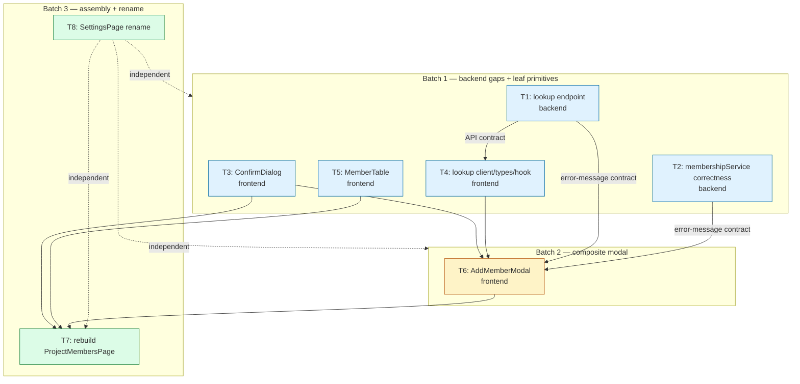

# Task Breakdown — SLYK-02 (Member Management)

**Source plan:** `docs/deliverables/SLYK-02.md`
**Implementation plan:** `docs/deliverables/SLYK-02-plan.md`
**Generated:** 2026-06-30

This document breaks the SLYK-02 plan into small, self-contained, parallelizable tasks. Each task touches a tightly-coupled set of files to minimize merge-conflict surface. Task numbering is **T1–T8**.

---

## Parallelization Strategy

### Batch model

| Batch | Tasks | Can all run in parallel? | Gate |
|-------|-------|--------------------------|------|
| **Batch 1** — foundation (backend gaps + leaf primitives) | T1, T2, T3, T4, T5 | ✅ Yes — every task is file-disjoint with zero inter-deps | Merge freely in any order |
| **Batch 2** — composite component (depends on B1) | T6 | n/a (single task) | Merge after T3 + T4 |
| **Batch 3** — assembly + rename | T7, T8 | ✅ Yes — T7 and T8 are file-disjoint | T7 merges after T3 + T5 + T6; T8 merges anytime |

### Merge-order rules (rebase-and-merge only — per `AGENTS.md`)

1. **Batch 1 merges first, in any order.** T1–T5 own disjoint files (see file-ownership matrix below) → no conflict between them.
2. **Within Batch 1**, T4's runtime correctness is only validated end-to-end once T1's endpoint exists, but T4 merges independently (it compiles against the documented contract).
3. **Batch 2 (T6 AddMemberModal)** must merge after **T3** (ConfirmDialog) and **T4** (lookup hook/types). For runtime validation of its error-mapping strings, T1, T2 must also be merged (the modal maps the exact server messages produced by T1/T2).
4. **Batch 3 T7 (page rebuild)** is the integration capstone — merges **last**, after T3, T5, T6 are all in the target branch.
5. **T8 (rename)** has zero dependencies and may land at any batch boundary as a low-risk warmup.
6. All PRs use **rebase-and-merge**; no merge commits, no squash.

### File-ownership matrix (conflict surface check)

| Task | Files touched |
|------|---------------|
| T1 | `backend/src/routes/projectMembers.schema.ts`, `backend/src/routes/projectMembers.routes.ts`, `backend/src/routes/projectMembers.routes.test.ts` *(NEW)* |
| T2 | `backend/src/services/membershipService.ts`, `backend/src/services/membershipService.test.ts` |
| T3 | `frontend/src/components/ConfirmDialog.tsx` *(NEW)*, `frontend/src/components/ConfirmDialog.test.tsx` *(NEW)* |
| T4 | `frontend/src/types/member.ts`, `frontend/src/api/members.ts`, `frontend/src/api/queryKeys.ts`, `frontend/src/hooks/useProjectMembers.ts`, `frontend/src/hooks/useDebouncedValue.ts` *(NEW)*, `frontend/src/hooks/useDebouncedValue.test.ts` *(NEW)* |
| T5 | `frontend/src/components/MemberTable.tsx` *(NEW)*, `frontend/src/components/MemberTable.test.tsx` *(NEW)* |
| T6 | `frontend/src/components/AddMemberModal.tsx` *(NEW)*, `frontend/src/components/AddMemberModal.test.tsx` *(NEW)*, `frontend/src/lib/queryClient.ts` *(tiny edit — suppressGlobalToast)* |
| T7 | `frontend/src/pages/ProjectMembersPage.tsx`, `frontend/src/pages/ProjectMembersPage.test.tsx` |
| T8 | `frontend/src/pages/SettingsPage.tsx`, `frontend/src/pages/SettingsPage.test.tsx` |

No file is owned by more than one task in the same batch → all intra-batch work is conflict-free.

### Summary table

| # | Batch | Title | Target Files | Dependencies | Can Parallel With |
|---|-------|-------|--------------|--------------|-------------------|
| **T1** | 1 | Backend: read-only `GET /:slug/members/lookup` endpoint + schema + HTTP test | `projectMembers.schema.ts`, `projectMembers.routes.ts`, `projectMembers.routes.test.ts` | None | T2, T3, T4, T5, T8 |
| **T2** | 1 | Backend: membershipService correctness (PA "Already a Member" + dup-email `CONFLICT`) + tests | `membershipService.ts`, `membershipService.test.ts` | None | T1, T3, T4, T5, T8 |
| **T3** | 1 | Frontend: generic `ConfirmDialog` primitive + test | `ConfirmDialog.tsx`, `ConfirmDialog.test.tsx` | None | T1, T2, T4, T5, T8 |
| **T4** | 1 | Frontend: lookup types + `lookupMember` API client + `useLookupMember` hook + `useDebouncedValue` helper | `types/member.ts`, `api/members.ts`, `api/queryKeys.ts`, `hooks/useProjectMembers.ts`, `hooks/useDebouncedValue.ts` | None (consumes T1 endpoint at runtime) | T1, T2, T3, T5, T8 |
| **T5** | 1 | Frontend: `MemberTable` primitive (User / Role / Status-derived / Actions) + test | `MemberTable.tsx`, `MemberTable.test.tsx` | None | T1, T2, T3, T4, T8 |
| **T6** | 2 | Frontend: `AddMemberModal` (single email input + auto-search + 4 branches) + test | `AddMemberModal.tsx`, `AddMemberModal.test.tsx`, `lib/queryClient.ts` | **T3, T4** (runtime contract: T1, T2) | T8 |
| **T7** | 3 | Frontend: rebuild `ProjectMembersPage` (heading, live search, table, modal trigger, confirm-on-remove) + tests | `ProjectMembersPage.tsx`, `ProjectMembersPage.test.tsx` | **T3, T5, T6** | T8 |
| **T8** | 3 | Frontend: rename "User Management" → "Member Management" in SettingsPage + test | `SettingsPage.tsx`, `SettingsPage.test.tsx` | None | *everything* |

### Dependency diagram



**ASCII fallback:**

```
BATCH 1 (all parallel, file-disjoint)        BATCH 2            BATCH 3
─────────────────────────────────            ───────            ───────
T1 lookup endpoint ─┐
T2 svc correctness ─┼─ (no inter-deps)
T3 ConfirmDialog ───┤
T4 lookup hook ─────┤──▶ T6 AddMemberModal ──▶ T7 rebuild ProjectMembersPage
T5 MemberTable ─────┘    (needs T3 + T4;        (needs T3 + T5 + T6)
                          runtime: T1 + T2)

T8 SettingsPage rename ──────────── (independent of ALL; merges anytime)
```

**Critical path:** `T1 → T4 → T6 → T7` (lookup end-to-page) is the longest chain and gates the modal's runtime behavior. `T3 → T6 → T7` and `T5 → T7` are the secondary chains. **T7 is the feature merge gate.**

### Developer assignment tracks (3 parallel lanes)

**Track A — Backend & API contract (1 dev)** — owns the lookup capability + correctness gaps + their tests.
- B1: T1 → T2 (then hand the lookup-response/error-message contract to Track B)
- B2/B3: review T6 and T7 against the merged contract
- *Why one dev:* T1–T2 are tightly coupled in `projectMembers.routes.ts` / `membershipService.ts`; a single owner avoids merge thrash. This lane is the **critical-path feeder** and must merge early.

**Track B — Frontend primitives & data layer (1 dev)** — owns shared components + the lookup client/hook; feeds both the modal and the page.
- B1: T3 (ConfirmDialog) → T4 (lookup client/hook, after T1's contract is agreed)
- B2: T6 (AddMemberModal — needs T3 + T4; validate against merged T1/T2)
- B3: support T7 (this dev knows the modal's prop surface best)
- *Why:* T6 is the most complex frontend piece (4 branches, debounce, double-toast opt-out). Giving the same dev the lookup hook + modal keeps the data-flow model in one head.

**Track C — Frontend assembly & rename (1 dev)** — owns the user-visible page surface; starts early on the independent rename.
- B1: T8 (SettingsPage rename — zero deps, lands first as a warmup) → T5 (MemberTable — needs only existing `ui/*` primitives)
- B3: T7 (rebuild ProjectMembersPage — the integration capstone; needs T3 + T5 + T6 merged)
- *Why:* T8 is a fast independent win that lets Track C ramp while Tracks A/B plough the critical path; Track C then inherits T5 and the final T7 assembly.

**Day-1 kickoff (all parallel, zero file overlap):** T1 + T2 (Track A) · T3 (Track B) · T5 + T8 (Track C). T4 queues behind T1's contract; T6 queues behind T3 + T4; T7 queues behind T3 + T5 + T6.

---

## Carried-forward decisions (v1 defaults — confirm before merge)

- **Status column (plan Open Question #1):** derived `Active` only for v1. `Member` (`types/member.ts`) has no `status`/`blocked` field; `users.blocked` is a global login gate, not surfaced on the project roster. **No schema change.** A `// TODO(SLYK-02)` marks the spot to switch to `Blocked`/`Active` when `Member` gains a `blocked` field.
- **Platform-Admin roster visibility (plan Open Question #2):** **do NOT** union Platform Admins server-side for v1 — the table lists explicit members only. Flagged as an Open Question; revisit if owners require implicit PA rows.
- **Add-PA behavior (plan Open Question #4):** hard error — `CONFLICT "Already a member"` (per spec wording "error"), no silent no-op.
- **Lookup location (plan §1):** **Option A** — mounted at `GET /api/projects/:slug/members/lookup` inside `projectMembers.routes.ts` (reuses the canonical `authenticate → validateRequest → requireProjectMember() → requireProjectAdmin()` chain). This **supersedes** the `users.routes.ts` mention in the plan's "Affected Components" table.
- **Zod versions:** backend is **zod v4**, frontend is **zod v3.25**. Cross-layer contract is a JSON shape, not shared schema code, so no conflict — but verify schema idioms per-side when implementing.

---

# Batch 1 — Foundation (no dependencies, all parallel)

---

## Task T1 — Backend: read-only member lookup endpoint

**Layer:** Backend (route + schema + test)
**Dependencies:** None

### Description

Add the read-only user-by-email lookup that powers the Add-Member modal's auto-search. **Option A** from the plan (supersedes the `users.routes.ts` mention in the Affected Components table): mount under the project scope so the existing layered RBAC chain is reused unchanged.

**Files:**
- `backend/src/routes/projectMembers.schema.ts` — add `lookupMemberSchema`.
- `backend/src/routes/projectMembers.routes.ts` — add `GET /:slug/members/lookup` handler.
- `backend/src/routes/projectMembers.routes.test.ts` — **NEW** file, supertest cases (follow the existing `report.routes.test.ts` mock harness pattern verbatim).

**Schema** (`projectMembers.schema.ts`, append near the other schemas; `slugParamSchema` is already imported):
```ts
// GET /:slug/members/lookup query — powers Add-Member modal auto-search.
export const lookupMemberSchema = {
  params: slugParamSchema,
  query: z.object({ email: z.email() }),
};
```

**Route** — insert above the existing `GET /:slug/members` roster route. Reuse the canonical chain `authenticate → validateRequest → requireProjectMember() → requireProjectAdmin()` exactly as the write routes do:
```ts
// GET /:slug/members/lookup — read-only email probe for the Add-Member modal.
// Admins-only (PA or PROJECT_ADMIN). 200 in both branches (found / not-found)
// so the client branches on the response shape, never on exceptions.
projectMembersRouter.get(
  '/:slug/members/lookup',
  authenticate,
  validateRequest(lookupMemberSchema),
  requireProjectMember(),
  requireProjectAdmin(),
  async (req, res) => {
    const { email } = req.query as { email: string };
    const user = await findUserByEmail(email);
    if (!user) {
      res.json(success({ exists: false }));
      return;
    }
    res.json(success({
      exists: true,
      user: {
        id: user.id,
        email: user.email,
        fullName: user.fullName,
        displayName: user.displayName,
        isPlatformAdmin: user.isPlatformAdmin,
      },
    }));
  },
);
```
- `findUserByEmail` (`userService.ts:18-22`) is already imported in the route file and returns `UserRow | undefined` carrying `isPlatformAdmin`. **No service change, no `userService.ts` edit.**
- **Privacy / anti-oracle:** response is minimal — **omit** `tokenVersion`, `googleId`, `blocked`. Both branches return `200` via `success()` (`utils/envelope.ts`).
- The non-revealing `FORBIDDEN 'You do not have access to this project'` invariant from `requireProjectMember`/`requireProjectAdmin` is preserved — unauthorized callers cannot probe for user existence.

**Test** — `projectMembers.routes.test.ts` (NEW). Clone the hoisted `TEST_ENV` + mock block pattern from `report.routes.test.ts` (mocks `../config`, `../db/client` with `transaction: async cb => cb({})`, `../services/membershipService`, `../services/projectService`, `../services/tokenVersion`). Mock `findUserByEmail` from `../services/userService`. Build `app` from `../index`, `signJwt` from `../utils/jwt`. Table-driven:
- exists → `200`, body `{ data: { exists: true, user: { id, email, fullName, displayName, isPlatformAdmin } } }`; assert no `tokenVersion`/`googleId`/`blocked` keys leak.
- not-found → `200`, `{ data: { exists: false } }`; assert `user` absent.
- invalid email query → `400` `VALIDATION_FAILED` (schema gate).
- non-admin member → `403` `FORBIDDEN` (override `getMemberRole` → `'MEMBER'`).
- unauthenticated → `401` `UNAUTHENTICATED`.

### Acceptance Criteria
- [ ] `GET /api/projects/:slug/members/lookup?email=<valid>` returns `200 {data:{exists:true,user:{...}}}` for a known email, `200 {data:{exists:false}}` for unknown.
- [ ] `user` payload contains exactly `{id,email,fullName,displayName,isPlatformAdmin}` — no `tokenVersion`, `googleId`, or `blocked`.
- [ ] Invalid email → `400 VALIDATION_FAILED`; non-admin → `403 FORBIDDEN`; no token → `401`.
- [ ] `lookupMemberSchema` exported from `projectMembers.schema.ts`; chain order matches the write routes.
- [ ] `projectMembers.routes.test.ts` co-located, all cases green (`rtk vitest` shows only failures).

---

## Task T2 — Backend: membershipService correctness (PA pre-check + duplicate-email CONFLICT)

**Layer:** Backend (service + test)
**Dependencies:** None (file-disjoint from T1: T1 touches routes/schema, this touches service only)

> The plan lists PA pre-check (§2) and duplicate-email CONFLICT (§3) as separate items, but both edit `membershipService.ts` + `membershipService.test.ts`. Running them as parallel tasks would guarantee a merge conflict, so they ship as **one tightly-coupled task** — both are service-layer error-mapping fixes for the Add-Member modal's branch messaging.

### Description

Close two backend correctness gaps so the modal's branch copy matches the spec.

**File:** `backend/src/services/membershipService.ts` (edits in two functions); **test:** `backend/src/services/membershipService.test.ts` (extend existing `describe` blocks). **No route changes** — both fixes live in the service so the route handlers are untouched.

**(a) Platform-Admin "Already a Member" pre-check** — `addExistingMember(projectId, userId, role = 'MEMBER')` (`membershipService.ts:163-189`). Currently this swallows `23505` into an idempotent upsert and would **insert a real membership row for a Platform Admin**, contradicting the "default member, no row needed" model enforced at the gate layer (`requireProjectMember.ts:46-52`). Before the insert transaction, resolve the target user and short-circuit on PA:
```ts
const target = await findUserById(userId);
if (!target) throw new AppError(ErrorCode.NOT_FOUND, 'User not found');
if (target.isPlatformAdmin) throw new AppError(ErrorCode.CONFLICT, 'Already a member');
// …existing db.transaction insert / 23505 idempotent upsert unchanged…
```
- `addExistingMember` only takes `userId`, so the service resolves `isPlatformAdmin` itself via `findUserById` (peer-service import idiom). The non-revealing `NOT_FOUND 'User not found'` for a missing user matches existing convention (`removeMember`, `setMemberRole`).
- The existing `23505` → role-update idempotency stays for genuine non-PA re-adds.

**(b) Duplicate-email → clean CONFLICT** — `createAndAddMember(email, fullName, displayName, projectId, role)` (`membershipService.ts:232-292`). Currently a duplicate email → `23505` on `users.email` bubbles up as `INTERNAL_ERROR` (500). Wrap the `users` insert; map SQLSTATE `23505` to `CONFLICT`. The module already defines `PG_UNIQUE_VIOLATION = '23505'` (`:18`) — reuse it. The domain gate `assertDomainAllowed` (`accessControl.ts:25`) stays **first** (FORBIDDEN ordering preserved, zero side effects on wrong-domain):
```ts
try {
  const [userRow] = await tx.insert(users).values({...}).returning({...});
} catch (cause) {
  if ((cause as { code?: string })?.code === PG_UNIQUE_VIOLATION) {
    throw new AppError(ErrorCode.CONFLICT, 'User already exists');
  }
  throw cause;
}
```

**Tests** — extend `membershipService.test.ts` using the existing `bag` mock harness (the `bag.txInsertReturning` mock is consumed sequentially inside `db.transaction`):
- `addExistingMember` describe — add `findUserById` mock wiring (mock `../services/userService`):
  - target `isPlatformAdmin: true` → rejects with `{ code: CONFLICT, message: 'Already a member' }` **and** `bag.txInsertReturning` not called (no row inserted).
  - target not found → `{ code: NOT_FOUND, message: 'User not found' }`.
  - regression — non-PA fresh add still returns the membership row.
- `createAndAddMember` describe — set `testEnv.env.allowedDomain = 'allowed.com'`:
  - users insert rejects with `{ code: '23505' }` → rejects `{ code: CONFLICT, message: 'User already exists' }` and the `project_members` insert did **not** run (`txInsertReturning` called once, not twice).
  - regression — non-`23505` insert error re-thrown unchanged.
  - regression — disallowed domain still `FORBIDDEN` before any insert.

### Acceptance Criteria
- [ ] `addExistingMember` with a PA `userId` throws `AppError(CONFLICT, 'Already a member')` and inserts **no** membership row.
- [ ] `addExistingMember` with an unknown `userId` throws `NOT_FOUND 'User not found'`.
- [ ] `createAndAddMember` with a duplicate email throws `AppError(CONFLICT, 'User already exists')`; the `project_members` insert does not execute.
- [ ] `createAndAddMember` wrong-domain still throws `FORBIDDEN` before any insert (regression).
- [ ] `addExistingMember` non-PA fresh-add + `23505` idempotent upsert paths still pass (regression).
- [ ] Only `membershipService.ts` + `membershipService.test.ts` changed — no route edits.

---

## Task T3 — Frontend: generic `ConfirmDialog` primitive

**Layer:** Frontend (new component + test)
**Dependencies:** None

### Description

Extract the shared confirm-dialog shape that `DeleteTicketConfirm.tsx` and `ConfirmDiscardDialog.tsx` already hand-roll. Required by the page rebuild (remove-with-confirm) and both Add-Member confirmation prompts (T6) — building it first as a leaf unblocks all of them.

**Files (both NEW):**
- `frontend/src/components/ConfirmDialog.tsx`
- `frontend/src/components/ConfirmDialog.test.tsx`

**Spec** — build on the shared `Modal` (`components/Modal.tsx:28-100`, props `{ isOpen, onClose, onEsc?, titleId, title, children, blockBackdropClose?, size? }`, renders into a portal with focus-trap/Esc/scroll-lock via `useModalA11y`). Fold the two existing shapes into one parameterized component:
```ts
interface ConfirmDialogProps {
  isOpen: boolean;
  title: string;
  titleId: string;                 // caller-supplied, unique per dialog (a11y)
  message?: React.ReactNode;       // body copy (omit to use children)
  children?: React.ReactNode;      // alternative to message for rich bodies
  confirmLabel?: string;           // default 'Confirm'
  cancelLabel?: string;            // default 'Cancel'
  variant?: 'default' | 'destructive';  // destructive → Button variant="destructive"
  pending?: boolean;               // disables both buttons + appends '…' to confirm
  onConfirm: () => void;
  onCancel: () => void;            // also wired to Modal onClose + Esc
  blockBackdropClose?: boolean;    // passed through to Modal (default true for confirms)
}
```
- Use `<Button variant={variant === 'destructive' ? 'destructive' : 'primary'} size="sm">` for confirm; `<Button variant="outline" size="sm">` for cancel (matches `DeleteTicketConfirm.tsx`).
- Confirm label while `pending`: append `…` (mirror `'Deleting…'`); disable both buttons.
- Pass `onEsc={onCancel}` and `blockBackdropClose` (default `true`) through to `Modal`.
- **Do NOT refactor `DeleteTicketConfirm`/`ConfirmDiscardDialog` in this task** — that is later cleanup and would expand the blast radius. Ship the new primitive; later batches adopt it.

**Test** — `ConfirmDialog.test.tsx`, Testing Library, priority `getByRole('dialog')` > `getByText`. Table-driven where useful:
- renders title + message when `isOpen`; renders nothing when `!isOpen`.
- `confirmLabel`/`cancelLabel` override the defaults.
- clicking Confirm fires `onConfirm`; clicking Cancel fires `onCancel`.
- `pending` disables both buttons and the confirm button shows the trailing `…`.
- `variant='destructive'` renders a destructive confirm button.
- a11y: Esc fires `onCancel` (via `useModalA11y`); when `blockBackdropClose`, backdrop click does **not** call `onCancel`.
- `titleId` is set as `aria-labelledby` on the dialog.

### Acceptance Criteria
- [ ] `ConfirmDialog` exported from `components/ConfirmDialog.tsx`, built on `Modal`, no other component edited.
- [ ] All props honored; defaults: confirm `'Confirm'`, cancel `'Cancel'`, `variant='default'`, `blockBackdropClose=true`.
- [ ] `pending` disables both buttons; confirm label gets trailing `…`.
- [ ] `variant='destructive'` → destructive confirm `Button`.
- [ ] Esc → `onCancel`; backdrop blocked when `blockBackdropClose`.
- [ ] `ConfirmDialog.test.tsx` co-located, all cases green.

---

## Task T4 — Frontend: lookup types + `lookupMember` API client + debounced `useLookupMember` hook

**Layer:** Frontend (types + api + hooks)
**Dependencies:** None (consumes T1's endpoint at runtime; compiles/merges independently — the API path is a string until wired in T6)

### Description

The typed, debounced client-side plumbing for the modal auto-search. Pure additions to existing files (no behavior change to existing exports).

**Files:**
- `frontend/src/types/member.ts` — add `LookupResult` + `LookupUser` (fold here, **not** a new `types/user.ts`).
- `frontend/src/api/members.ts` — add `lookupMember(slug, email)`.
- `frontend/src/api/queryKeys.ts` — add `memberKeys.lookup(slug, email)`.
- `frontend/src/hooks/useProjectMembers.ts` — add `useLookupMember(slug, email)`.
- `frontend/src/hooks/useDebouncedValue.ts` — **NEW** small helper.
- `frontend/src/hooks/useDebouncedValue.test.ts` — **NEW** test.

**Type** (`types/member.ts`, append):
```ts
// GET /projects/:slug/members/lookup result. `user` present only when exists.
export interface LookupUser {
  id: string;
  email: string;
  fullName: string;
  displayName: string | null;
  isPlatformAdmin: boolean;
}
export interface LookupResult {
  exists: boolean;
  user?: LookupUser;
}
```

**API client** (`api/members.ts`, append; reuse `apiFetch` at `client.ts:91` — it unwraps `.data` and throws `ApiClientError(message, status, code, details)` on `!ok`):
```ts
export function lookupMember(slug: string, email: string): Promise<LookupResult> {
  return apiFetch<LookupResult>(
    `/projects/${slug}/members/lookup?email=${encodeURIComponent(email)}`,
  );
}
```
The endpoint returns `200` in both branches, so the hook branches on `data.exists`, **not** on a thrown error.

**Debounce helper** (`hooks/useDebouncedValue.ts`, NEW) — a reusable replacement for the hand-rolled `setTimeout` 300ms pattern duplicated in `BoardFilters.tsx:42-50`:
```ts
export function useDebouncedValue<T>(value: T, delayMs = 300): T {
  // useState + useEffect with setTimeout/clearTimeout cleanup; returns latest value after delayMs
}
```

**Query key** (`api/queryKeys.ts`, next to `forProject`): `lookup: (slug, email) => [...memberKeys.forProject(slug), 'lookup', email] as const`.

**Hook** (`hooks/useProjectMembers.ts`, append; mirror the existing `useQuery` shape):
```ts
export function useLookupMember(slug: string, email: string) {
  const debouncedEmail = useDebouncedValue(email.trim(), 300);
  const enabled = isEmail(debouncedEmail);   // simple /^[^\s@]+@[^\s@]+\.[^\s@]+$/ gate
  return useQuery({
    queryKey: memberKeys.lookup(slug, debouncedEmail),
    queryFn: () => lookupMember(slug, debouncedEmail),
    enabled,
    staleTime: 15_000,
    retry: false,            // a 4xx (e.g. 403) must not retry
  });
}
```
- Keyed on `[slug, debouncedEmail]` so React Query naturally discards stale lookups as the user types.
- Query errors are **not** globally toasted (only mutations are — `lib/queryClient.ts:24-31`), so inline handling stays clean; no `meta` needed here.

**Test** — `useDebouncedValue.test.ts` with `vi.useFakeTimers()`: initial value returns immediately; rapid successive changes surface only the last after `delayMs`; cleanup clears the pending timer on unmount (no state-update-after-unmount warning). No test required for the thin hook/api wrappers (cover their behavior via `AddMemberModal.test.tsx` in T6).

### Acceptance Criteria
- [ ] `LookupResult`/`LookupUser` exported from `types/member.ts`.
- [ ] `lookupMember(slug, email)` calls `GET /projects/:slug/members/lookup?email=` (URL-encoded) via `apiFetch`, returns `LookupResult`.
- [ ] `useDebouncedValue` helper created; `useLookupMember` debounces 300 ms, is enabled only for valid emails, `retry: false`, keyed on `[slug, debouncedEmail]`.
- [ ] `memberKeys.lookup(slug, email)` added.
- [ ] No existing export's signature or behavior changed.
- [ ] `useDebouncedValue.test.ts` green under fake timers.

---

## Task T5 — Frontend: `MemberTable` primitive

**Layer:** Frontend (new component + test)
**Dependencies:** None (uses existing `ui/*` primitives: `Avatar`, `Badge`, `SelectInput`, `Button`)

### Description

Create `frontend/src/components/MemberTable.tsx`: a purpose-built members `<table>` (Tailwind tokens: `border-border`, `bg-background`, `text-foreground`, `text-muted-foreground`) that replaces the current `<ul>` of `<Card>` rows in `ProjectMembersPage.tsx:104-113`. **Presentational only** — no mutations, no toasts, no confirm dialogs. It calls back; the owning page (T7) wires `useUpdateMemberRole`/`useRemoveMember` + `ConfirmDialog`.

**Props (explicit interface):**
```ts
interface MemberTableProps {
  members: Member[];
  canManage: boolean;          // Platform Admin OR Project Admin
  currentUserId?: string;      // for self-lock; undefined when not a real member
  onRoleChange: (userId: string, role: MemberRole) => void;
  onRemove: (userId: string) => void;
}
```

**Columns:**
1. **User** — `Avatar` (size `sm`, `src={member.avatarUrl ?? undefined}`, `name={member.displayName ?? member.fullName ?? member.email}`) + primary line (`member.displayName ?? member.fullName || member.email`, truncate) + secondary line (`member.email`, truncate, `text-muted-foreground`). Append a `<Badge>` "You" when `member.userId === currentUserId`.
2. **Project Role** — if `canManage`: an inline role `SelectInput` with options `Member`/`Project Admin` (port the `<RoleSelect>`/`<RoleBadge>` subcomponents from `ProjectMembersPage.tsx:283-329`, built on `ui/SelectInput`); else a `Badge` (`PROJECT_ADMIN` vs `MEMBER`). Self-lock: when `isSelf && member.role === 'PROJECT_ADMIN'`, disable the select (preserve current behavior at `ProjectMembersPage.tsx:312-313`).
3. **Status** — **derived client-side, no schema change.** `Member` has no `status`/`blocked` field, so v1 shows derived `Active` for every roster row (a roster row exists ⇒ active member). Render `Badge` "Active" (muted). Leave a `// TODO(SLYK-02): surface users.blocked when Member gains the field` comment.
4. **Actions** — only when `canManage`: the **Remove** `Button` (`variant="destructive"`, `Trash2` icon, `aria-label={`Remove ${member.email}`}`). Self-lock disables Remove when `isSelf` (preserve `ProjectMembersPage.tsx:259-266`). For non-admins this column is omitted.

**Self-lock invariant (must match existing):** cannot demote or remove self. `isSelf = member.userId === currentUserId`. Disable both the role select (when current role is `PROJECT_ADMIN`) and the Remove button.

**Rendering rules:**
- Empty `members` → render nothing (the page owns the empty state; do not duplicate).
- Responsive: table scrolls horizontally on small viewports (`overflow-x-auto`); rows use `whitespace-nowrap` on action cells.
- a11y: `<table>` with `<thead>`/`<tbody>`, `scope="col"` on `<th>`, `scope="row"` on the User cell. Each Remove button has a descriptive `aria-label`. The role `SelectInput` carries `aria-label={`Role for ${member.email}`}`.
- **No search input here** — live search lives in the page (T7).

**Test** — `MemberTable.test.tsx` (co-located, Vitest + Testing Library):
- Renders one `<tr>` per member; avatar/name/email present.
- Non-admin (`canManage=false`) sees a role `Badge`, **no** select, **no** Remove button.
- Admin (`canManage=true`) sees the role `SelectInput` and Remove button.
- Self-lock: for the row where `userId === currentUserId` with role `PROJECT_ADMIN`, the select is disabled AND the Remove button is disabled.
- `onRoleChange` fires with `(userId, 'PROJECT_ADMIN')` when an admin changes a non-self row's select.
- `onRemove` fires with `userId` when an admin clicks Remove on a non-self row.

### Acceptance Criteria
- [ ] `MemberTable.tsx` exists, exports `MemberTable`, with the exact prop interface.
- [ ] No mutations/toasts/confirm logic inside the component (pure presentational + callbacks).
- [ ] Four columns render: User (Avatar + name + email), Project Role (select for admins / Badge for non-admins), Status (derived `Active` Badge with TODO comment), Actions (Remove for admins).
- [ ] Self-lock disables both self-demotion (when `PROJECT_ADMIN`) and self-removal.
- [ ] `canManage=false` renders no select and no Remove button.
- [ ] `<table>`/`<thead>`/`<tbody>`, `scope` attributes, and descriptive `aria-label`s present.
- [ ] `MemberTable.test.tsx` passes: row count, admin vs non-admin controls, self-lock, callback invocations.
- [ ] No console errors; types compile (`import type` for type-only imports).

---

# Batch 2 — Composite component (depends on Batch 1)

---

## Task T6 — Frontend: `AddMemberModal` (single email input + auto-search + 4 branches)

**Layer:** Frontend (new component + test + tiny global-cache edit)
**Dependencies:** **T3** (ConfirmDialog), **T4** (lookup hook/types/api). Runtime error-message contract: **T1**, **T2**.
**This is the core of SLYK-02.**

### Description

Create `frontend/src/components/AddMemberModal.tsx`: a modal built on the shared `Modal` (`components/Modal.tsx:28-100`; recommend `size="md"`, `blockBackdropClose` while the create form is dirty). Single email `TextInput` at top that **auto-searches** as the user types via `useLookupMember(slug)` (T4). Shows inline status while resolving. Once a **valid email** is entered and the lookup resolves, render exactly one of **four branches**.

**Props:**
```ts
interface AddMemberModalProps {
  slug: string;
  isOpen: boolean;
  onClose: () => void;
}
```
Internally reads `useProjectMembers(slug)` (roster) for the client-side already-member check and `useLookupMember(slug)` driven by local `email` state.

**Lookup gating:**
- Lookup query is **enabled only when `email` is a valid email** and is debounced (T4 owns the debounce). Do not fire lookup for partial/invalid input.
- Ignore stale results: only honor the response whose key matches the current trimmed email.
- While `isFetching`, show a subtle "Searching…" inline indicator (no blocking spinner).

**Branch logic (the four outcomes):**

1. **Already a member of this project** — client-side: `roster.some(m => m.email.toLowerCase() === email.toLowerCase())` → inline error **"Already a Member"**, primary action disabled, no mutation. (Check **before** trusting the lookup result so a stale/late lookup can't override it.)
2. **Platform Admin** — lookup resolved `exists && user.isPlatformAdmin === true` (and not branch 1) → inline error **"Already a Member"** (PAs are default members of all projects), primary disabled, no mutation. (Mirrors T2's server-side CONFLICT; client check gives instant UX.)
3. **Exists on platform** — `exists && !isPlatformAdmin && !alreadyMember` → render user details (Avatar + `fullName`/`displayName` + email, read-only) + a **Project Role** `SelectInput` (`Member`/`Project Admin`, default `MEMBER`) + a **confirmation prompt**. On confirm → open `ConfirmDialog` ("Add {name} to this project as {role}?") → on `ConfirmDialog.onConfirm` call `useAddMember(slug).mutateAsync({ email, role })` → on success: success toast "Member added." + `onClose()`. On error: map inline (below).
4. **Does not exist** — `!exists` → **expand** the modal: reveal **Full Name** (`TextInput`, optional), **Display Name** (`TextInput`, optional), **Email** (read-only, pre-filled), and a **Project Role** `SelectInput` (default `MEMBER`). On submit (client-validated; optional names trimmed) → open `ConfirmDialog` ("Create {email} and add them to this project as {role}?") → on confirm call `useCreateAndAddMember(slug).mutateAsync({ email, fullName, displayName, role })` → on success: success toast "Member created and added." + `onClose()`. On error: map inline.

**Inline error mapping (backend → modal message)** using `ApiClientError` (`status`/`code`/`message`):
- `CONFLICT` + message includes "Already a member" → **"Already a Member"**.
- `FORBIDDEN` + message includes "allowed"/"domain" → **"domain not allowed"** (T2/`accessControl.ts` domain path).
- `CONFLICT` + message includes "already exists" → **"already exists"** (T2 race-duplicate path).
- Anything else → `err.message` fallback or "Something went wrong."

Show the mapped message **inline inside the dialog** (a `role="alert"` region under the form), never as a generic toast.

**Double-toast suppression (CRITICAL — `lib/queryClient.ts:24-31`):** the global `MutationCache.onError` toasts **every** mutation error; `meta.revertMessage` overrides text **only**, it does not suppress. **Preferred approach (project-wide convention going forward):** honor a `meta.suppressGlobalToast: true` flag. This requires a tiny, well-scoped edit to `lib/queryClient.ts`:
```ts
const meta = mutation.meta as { revertMessage?: string; suppressGlobalToast?: boolean } | undefined;
if (meta?.suppressGlobalToast) return;        // local handler owns the UX
toast.error(meta?.revertMessage ?? defaultMessage(error));
```
Then pass `meta: { suppressGlobalToast: true }` on the `useAddMember`/`useCreateAndAddMember` calls issued from this modal **only** (other callers keep current behavior). **Alternative** (if the team rejects touching the global cache): catch the error in the modal's async handler and swallow it so the cache never sees it. Pick one, apply consistently, and document the chosen mechanism in a top-of-file comment.

**Form/modal behavior:**
- `Modal` `title="Add Member"`, stable `titleId` (e.g. `"add-member-title"`).
- `blockBackdropClose={true}` while the branch-4 create form has dirty input; Esc still works unless dirty.
- Reset all local state (email, names, role, error) on `onClose` and on successful mutation.
- Primary action disabled while `isFetching`, while invalid email, while a mutation `isPending`, or in branches 1 & 2.
- Reuse `ui/TextInput`, `ui/SelectInput`, `ui/Button`, `ui/Avatar`, `ui/Badge` — no bespoke inputs.

**Test** — `AddMemberModal.test.tsx` (co-located). Mock `useLookupMember`, `useProjectMembers`, `useAddMember`, `useCreateAndAddMember`, and `ConfirmDialog`. **Table-driven** suite with `{ name, email, roster, lookupResult, expectedBranch, expectedActions }` rows:
- Branch 1 — email in roster → "Already a Member", primary disabled.
- Branch 2 — `lookupResult.user.isPlatformAdmin` → "Already a Member", primary disabled, **no mutation called**.
- Branch 3 — exists, not PA, not already-member → details + role select; selecting role + confirm → `ConfirmDialog` opens → confirm → `useAddMember` called with `{ email, role }` → success toast + `onClose`.
- Branch 4 — `!exists` → form expands (Full Name, Display Name, read-only Email, Role) → fill + confirm → `ConfirmDialog` → confirm → `useCreateAndAddMember` called with trimmed body → success toast + `onClose`.
- Error mapping: `useAddMember` rejecting with `ApiClientError(CONFLICT, "Already a member")` → inline "Already a Member" and **no global toast**; `FORBIDDEN` domain → "domain not allowed"; `CONFLICT "User already exists"` → "already exists".
- Suppression: assert the global toast is **not** invoked when `suppressGlobalToast` is set (or, under the swallow approach, that the cache-side path is bypassed).
- Invalid/partial email → lookup **not** called, no branch rendered, primary disabled.
- `onClose` resets state (re-open shows clean form).
- a11y: modal labelled, `role="alert"` error region, form controls labelled, Esc closes (unless dirty).

### Acceptance Criteria
- [ ] `AddMemberModal.tsx` exists, exports `AddMemberModal`, with the exact prop interface.
- [ ] Auto-search fires only for valid emails via `useLookupMember`; stale results ignored; "Searching…" indicator while fetching.
- [ ] **All four branches** implemented exactly as specified (already-member client-side first; PA → "Already a Member"; exists → details + role + confirm → add; not-exists → expand form + confirm → create).
- [ ] Both confirmation paths use `ConfirmDialog` (T3).
- [ ] Inline error mapping covers CONFLICT "Already a member" → "Already a Member", FORBIDDEN domain → "domain not allowed", CONFLICT "User already exists" → "already exists"; errors shown inline in a `role="alert"` region.
- [ ] Double-toast suppression implemented (either `meta.suppressGlobalToast` honored in `lib/queryClient.ts` **or** local swallow), with a top-of-file comment naming the mechanism. No duplicate global toast.
- [ ] `blockBackdropClose` engaged while the create form is dirty; Esc respected when not dirty.
- [ ] State resets on close and on success; primary disabled during fetch/pending/invalid.
- [ ] No bespoke inputs — uses `ui/TextInput`, `ui/SelectInput`, `ui/Button`, `ui/Avatar`, `ui/Badge`.
- [ ] `AddMemberModal.test.tsx` passes the table-driven four-branch suite incl. error mapping and suppression assertion.
- [ ] `import type` for type-only imports; types compile.

---

# Batch 3 — Assembly + rename

---

## Task T7 — Frontend: rebuild `ProjectMembersPage` (heading, live search, table, modal trigger, confirm-on-remove)

**Layer:** Frontend (page rewrite + test)
**Dependencies:** **T3** (ConfirmDialog), **T5** (MemberTable), **T6** (AddMemberModal)

### Description

Replace the legacy inline-`<ul>`-of-cards layout (`ProjectMembersPage.tsx:104-113`) with the new shared primitives. The page becomes a thin assembly layer: heading, live-search input, `<MemberTable>`, the top-right **Add Member** button → `<AddMemberModal>`, and confirm-gated removal. Remove the obsolete `<AddMemberSection>` card (`:91-93` render, `:135-267` definition) and its two-mode toggle forms entirely — the modal now owns all add flows. Non-managers keep the read-only fallback.

**Target files:**
- `frontend/src/pages/ProjectMembersPage.tsx` (rewrite)
- `frontend/src/pages/ProjectMembersPage.test.tsx` (extend)

**What changes:**
- Page H1 → **"Member Management"** (was `Members`).
- **Delete** `<AddMemberSection>` (component + both forms + mode toggle); remove dead imports.
- An **"Add Member"** button renders **top-right of the header**, visible **only when `canManage`** (`:60` gate — `isPlatformAdmin || isProjectAdmin`), opening `<AddMemberModal>` on click. Non-managers never see it.
- A `TextInput` (live search) renders above the table; `useMemo` filters the roster case-insensitively by partial match on `fullName` **OR** `displayName` **OR** `email`; an empty query shows all rows.
- `<MemberTable>` receives `members` (filtered), `canManage`, `currentUserId`, and `onRoleChange`/`onRemove` callbacks.
- Role change wired through `useUpdateMemberRole(slug)` (existing hook; roster + project detail caches invalidate automatically via `useProjectMembers.ts`).
- Remove wired through `useRemoveMember(slug)` **wrapped in `<ConfirmDialog variant="destructive">`** — the row's remove action opens the dialog first; delete fires only on confirm. The previous immediate-remove path (`MemberRow` handler `:225-232`) is gone.
- Self-lock behavior preserved: a user cannot demote/remove themselves.
- Read-only fallback for non-managers preserved (badge instead of select, no remove button).

**Tests added** (extend `ProjectMembersPage.test.tsx`):
- "Add Member" button **visible for Project Admin / Platform Admin**, **absent for plain Member**.
- Remove click **opens `ConfirmDialog`**; confirming invokes `useRemoveMember` and the member disappears; cancelling closes without a delete.
- Role change fires `useUpdateMemberRole` and triggers roster + project-detail invalidation.
- Live search: typing a partial name **and** a partial email (table-driven) filters rows; clearing restores all.
- No regressions: loading skeleton, error `<Retry>`, empty-roster state all still render.

### Acceptance Criteria
- [ ] Page H1 reads **"Member Management"**.
- [ ] `<AddMemberSection>` deleted; no dead imports remain.
- [ ] "Add Member" button renders top-right, visible **only when `canManage`**, opens `<AddMemberModal>`.
- [ ] `TextInput` live search filters the roster by partial `fullName`/`displayName`/`email` via `useMemo`; empty query shows all.
- [ ] `<MemberTable>` receives `members` (filtered), `canManage`, `currentUserId`, `onRoleChange`, `onRemove`.
- [ ] Role change wired through `useUpdateMemberRole`; roster + project detail invalidate on success.
- [ ] Remove wired through `useRemoveMember` wrapped in `<ConfirmDialog variant="destructive">`; the immediate-remove path is gone.
- [ ] Self-lock preserved (cannot demote/remove self); read-only fallback for non-managers preserved.
- [ ] Tests pass: button visibility by role, remove-then-confirm, role-change invalidation, table-driven live search, no regressions on loading/error/empty states.

---

## Task T8 — Frontend: rename "User Management" → "Member Management" (SettingsPage)

**Layer:** Frontend (page + test)
**Dependencies:** None — fully independent; safe to pick up at any batch boundary as a low-risk warmup.

### Description

A pure rename: the global platform "Settings" page heading changes from **"User Management"** to **"Member Management"**. The matching test assertion is updated in lockstep. **No nav label changes** — `TopNav.tsx:57` stays "Settings" (verified: that label is not "User Management").

**Target files:**
- `frontend/src/pages/SettingsPage.tsx` (H1 at `:64`)
- `frontend/src/pages/SettingsPage.test.tsx` (assertion at `:30`)

**Scope clarification:** there is **no descriptive copy block** near the H1 — the `:265` range referenced in the plan is confirm-dialog helper switches, not intro copy. Only the H1 string changes.

### Acceptance Criteria
- [ ] `SettingsPage.tsx:64` H1 reads **"Member Management"**.
- [ ] No other copy in `SettingsPage.tsx` references "User Management".
- [ ] `SettingsPage.test.tsx:30` assertion updated to `name: 'Member Management'`; test passes.
- [ ] `TopNav.tsx:57` "Settings" label is **unchanged** (regression guard).

---

*End of task breakdown.*
