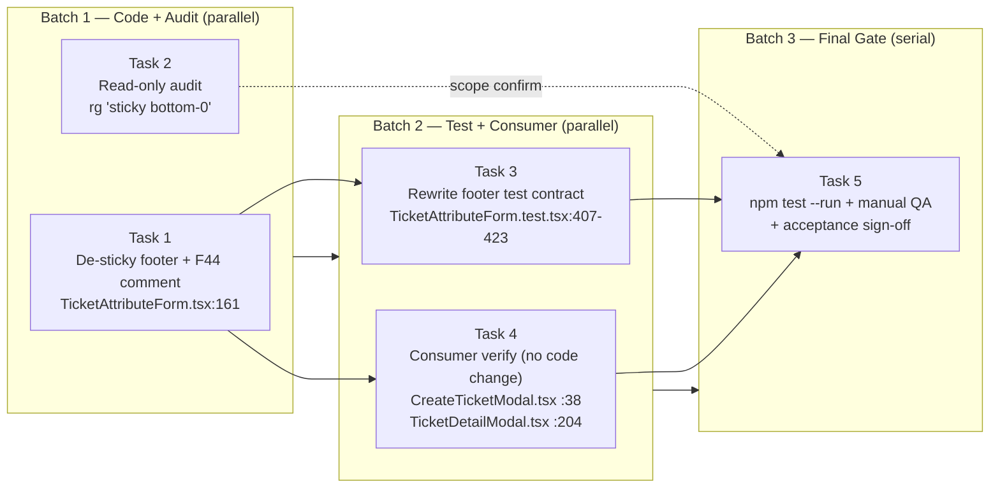

# Task Breakdown — SLYK-15 (Ticket Modal Sticky Footer Gap)

**Plan:** `docs/deliverables/SLYK-15-plan.md`
**Ticket:** `docs/deliverables/SLYK-15.md` (Bug)
**Approach:** A — render the `TicketAttributeForm` footer non-sticky.
**Generated:** 2026-06-30

> **Line-number note:** The plan's `:line` citations for `TicketAttributeForm.tsx`
> and its test are **accurate**. The Phase-1 codebase audit found the plan's
> citations for **other** files were shifted in the source. This breakdown uses
> the **corrected** line numbers throughout:
>
> | File | Plan said | Correct |
> |------|-----------|---------|
> | `Modal.tsx` panel `p-6` scroll container | `:81` | **`:66`** |
> | `Modal.tsx` header block | `69–78` | **`70–82`** |
> | `TicketDetailModal` Details tab | `150–261` | **`182–231`** (form render `:204`, `<Modal>` `:280`) |
> | `TicketDetailModal` form render | `212–221` | **`:204`** |
> | `index.css` `html,body,#root` height rule | `108–110` | **`137–141`** |
> | `index.css` `--background` var | `11`, `53` | **`:10`**, **`:54`** |
> | `useModalA11y.ts` body `overflow:hidden` | `:48` | **`:39`** |
>
> `TicketAttributeForm.tsx:161` (footer class), `:159–160` (F44 comment),
> `:81–84` (`<fieldset disabled>`), `:123` (right-column scroll), and
> `TicketAttributeForm.test.tsx:407–423` (sticky-footer test) are all **correct as
> cited**.

---

## Phase-1 Codebase Analysis (summary)

All cited files exist and the bug description is accurate. Key findings that
shape the tasks:

1. **The fix is isolated to one class string + one comment + one test.**
   `rg "sticky bottom-0"` across `frontend/src` returns exactly **one** match —
   `TicketAttributeForm.tsx:161`. No sibling form/modal reuses the pattern.
2. **Two consumers render `TicketAttributeForm`** (both inherit the footer, no
   change needed there): `TicketDetailModal.tsx:204` (`mode="edit"`,
   `Modal size="full"` at `:280`) and **`CreateTicketModal.tsx:38`
   (`mode="create"`, `Modal size="xl"`)** — the plan under-emphasised
   `CreateTicketModal`, which is an affected consumer.
3. **The shared `Modal` (`Modal.tsx:66`) is a single scroll container** with
   `max-h-[90vh] ... overflow-y-auto ... p-6`, no header/footer slot, no
   flex-column split. Under Approach A it is **untouched**.
4. **No shared `Footer` / `ActionButtons` component exists** — action bars are
   inlined per modal. Nothing to refactor onto.
5. **The footer is Details-tab-scoped** (it lives inside `TicketAttributeForm`,
   inside the Details `TabsContent` at `TicketDetailModal.tsx:182`). Time
   Tracking and Activity tabs render no footer.
6. **The existing regression test will break** if `sticky` is removed:
   `TicketAttributeForm.test.tsx:407–423` queries `form > div.sticky` (`:417`).
   It must be rewritten to the new non-sticky contract.
7. `submitLabel` is **derived from `mode`** (`TicketAttributeForm.tsx:59`), not a
   prop: `edit` → `'Save changes'`, `create` → `'Create ticket'`.
8. The footer `<div>` is the **last child of `<form>`** (`:167`), a **sibling**
   of `<fieldset disabled={readOnly}>` (`:81–84`) — so Cancel/Close stay
   clickable in `readOnly` mode. Preserve this.

---

## Parallelization Strategy

The fix is small and structurally linear. Three batches, strictly sequential
between batches, fully parallel within each batch.

### Merge-order rules

- **Batch 1 must merge before Batch 2 starts.** Batch 2 depends on the new
  footer class string produced by Task 1.
- **Batch 2 must merge before Batch 3.** Task 5's `npm test` gate requires the
  rewritten test (Task 3) and the consumer check (Task 4).
- Within a batch, tasks touch **disjoint files** → zero merge conflicts.

### Visual batch diagram



ASCII fallback:

```
Batch 1 (parallel)        Batch 2 (parallel)        Batch 3 (serial gate)
──────────────────        ──────────────────        ─────────────────────
 Task 1  de-sticky ──┐    Task 3  test rewrite ──┐
        footer       │            contract       │
                     ├──▶                         ├──▶ Task 5
 Task 2  audit       │    Task 4  consumer verify│     npm test --run
        (read-only) ─┘            (no change)   ─┘     + manual QA + sign-off
```

Solid = hard dependency. Dashed = scope/finality re-check only (Task 2 stays
read-only; it is re-run at the gate as a confirmation sweep).

### Summary table

| # | Batch | Target File | Dependencies | Can Parallel With |
|---|-------|-------------|--------------|-------------------|
| 1 | 1 | `frontend/src/components/TicketAttributeForm.tsx` (footer `:161`, F44 comment `:159-160`) | — | Task 2 |
| 2 | 1 | `frontend/src/**` (read-only `rg "sticky bottom-0"` / `-mb-6` / `-mx-6`) | — | Task 1 |
| 3 | 2 | `frontend/src/components/TicketAttributeForm.test.tsx:407-423` | Task 1 | Task 4 |
| 4 | 2 | `frontend/src/components/CreateTicketModal.tsx` (`:38`), `frontend/src/components/TicketDetailModal.tsx` (`:204`, `:280`) — verify only | Task 1 | Task 3 |
| 5 | 3 | none (run `npm test --run` in `frontend/` + manual QA) | Tasks 3 & 4 | — (serial close gate) |

### Developer assignment tracks

- **Track A — "Fix owner" (recommended, zero handoffs):**
  `Task 1 → Task 3 → Task 5`. One developer owns the class-string diff, rewrites
  its own test, then runs the gate. Highest context retention on the exact diff.
- **Track B — "QA / audit" (parallel support):**
  `Task 2 → Task 4`. One developer owns both read/inspection tasks (both are
  verify-only with no writes), then joins Task 5 at the gate.
- **Track C — "Gate closer" (final):**
  `Task 5` only — the Track-A owner (preferred, knows the change) or a second
  developer for independent sign-off.

**Critical path:** `T1 → T3 → T5` (Track A end-to-end).

---

## Batch 1 — no dependencies (parallel-safe)

### Task 1 — De-sticky the TicketAttributeForm footer + update F44 comment

**Title:** `feat(SLYK-15): render TicketAttributeForm footer non-sticky`

**Description:**

The form footer relies on `sticky bottom-0` plus negative-margin hacks
(`-mx-6 -mb-6`) to counteract `Modal.tsx:66`'s single padded scroll container
(`max-h-[90vh] ... overflow-y-auto ... p-6`). The sticky element tracks scroll
position; across the stuck → unstuck transition the in-flow footprint no longer
covers the panel's `p-6` bottom-padding strip, so scrolling content (which lives
behind the footer in the same scroll container) bleeds through — the reported
gap. Removing `sticky`, `bottom-0`, and the negative margins **structurally
eliminates** the mechanism: the footer becomes a normal in-flow block at the end
of the form.

**Files touched:**
- `frontend/src/components/TicketAttributeForm.tsx`
  - Lines **159–160** (F44 comment)
  - Line **161** (footer `<div>` className)

**Exact change:**

*Before — comment (`TicketAttributeForm.tsx:159-160`):*
```jsx
{/* F44: sticky footer, right-aligned, single Button size. Lives
    outside <fieldset disabled> so Cancel/Close remain clickable. */}
```
*After:*
```jsx
{/* F44: footer, right-aligned, single Button size. Lives
    outside <fieldset disabled> so Cancel/Close remain clickable. */}
```

*Before — className (`TicketAttributeForm.tsx:161`):*
```
sticky bottom-0 -mx-6 -mb-6 mt-6 flex justify-end gap-2 border-t border-border bg-background px-6 py-3
```
*After:*
```
mt-6 flex justify-end gap-2 border-t border-border bg-background pt-6
```

**Preserved invariants (must NOT regress):**
- Footer `<div>` stays the **last child of `<form>`** (`:167`), sibling of
  `<fieldset disabled={readOnly}>` (`:81–84`) → Cancel/Close stay clickable in
  `readOnly` mode.
- `submitLabel` button renders only when `!readOnly`; the Cancel/Close label
  toggle (`readOnly ? 'Close' : 'Cancel'`) is untouched.
- Both consumers inherit the fix with no change there: `TicketDetailModal.tsx:204`
  (`mode="edit"`) and `CreateTicketModal.tsx:38` (`mode="create"`).

**Acceptance Criteria:**
- [ ] `TicketAttributeForm.tsx:161` className equals exactly
      `mt-6 flex justify-end gap-2 border-t border-border bg-background pt-6`.
- [ ] Class string no longer contains `sticky`, `bottom-0`, `-mx-6`, `-mb-6`,
      `px-6`, or `py-3`.
- [ ] `bg-background`, `border-t border-border`, `justify-end`, `gap-2`, `flex`,
      and `mt-6` are retained.
- [ ] F44 comment (`:159-160`) no longer contains the word "sticky".
- [ ] Footer `<div>` is still the last child of `<form>` (`:167`) and still
      outside `<fieldset disabled={readOnly}>` (`:81–84`).
- [ ] No other files modified.

**Dependencies:** None.

---

### Task 2 — Codebase audit: confirm the sticky-footer pattern is isolated

**Title:** `audit(SLYK-15): confirm no sibling reuse of sticky-bottom-0 footer pattern`

**Description:**

Read-only audit certifying the buggy pattern (`sticky bottom-0` combined with
`-mb-6` / `-mx-6` negative-margin bleed) is isolated to `TicketAttributeForm`.
Phase-1 analysis found no other matches; this task formally re-confirms before
the fix lands and records every match as a durable record. **Writes no files** —
parallel-safe with Task 1.

**Commands (run from repo root, read-only):**
```bash
rg -n 'sticky bottom-0' frontend/src
rg -n '\-mb-6' frontend/src
rg -n '\-mx-6' frontend/src
rg -n 'sticky' frontend/src   # broader sweep for any sticky-footer variant
```

**Acceptance Criteria:**
- [ ] Ran all four `rg` commands across `frontend/src`.
- [ ] Every match for `sticky bottom-0` listed with `file:line` + one-line note.
- [ ] Every match for `-mb-6` listed with `file:line`.
- [ ] Every match for `-mx-6` listed with `file:line`.
- [ ] The only `sticky bottom-0` occurrence paired with `-mb-6`/`-mx-6` is
      `TicketAttributeForm.tsx:161` (Task 1's target).
- [ ] Any other match flagged with a recommendation (keep / needs-fix /
      out-of-scope) but **not** modified by this task.
- [ ] `git status` clean (no files written).
- [ ] Final summary line states `ISOLATED — no sibling reuses` **or**
      `FOUND-N — list follows`.

**Dependencies:** None.

---

## Batch 2 — depends on Task 1 (parallel within batch)

### Task 3 — Update the footer regression test to the non-sticky contract

**Title:** `test(SLYK-15): rewrite footer test for the non-sticky contract`

**Description:**

Task 1 removes the `sticky bottom-0` class. The existing regression test at
`frontend/src/components/TicketAttributeForm.test.tsx:407-423` ("footer is
sticky and right-aligned…") queries `document.querySelector('form > div.sticky')`
at `:417` — **this will break** once the `sticky` class is gone. Rewrite it to
assert the new contract.

**New contract to assert:**
1. **Footer is NOT sticky** — footer div does **not** contain `sticky`, `-mx-6`,
   or `-mb-6` in its className. Find the footer by a stable trait
   (e.g. `form > div:last-child`) instead of `.sticky`.
2. **Footer IS right-aligned** — `className` contains `justify-end`.
3. **Correct action buttons per mode** (table-driven `forEach` over the rows
   below, per `AGENTS.md` unit-test convention):
   | mode | readOnly | expected submit button | expected outline button |
   |------|----------|------------------------|--------------------------|
   | `create` | `false` | `'Create ticket'` | `'Cancel'` |
   | `edit`   | `false` | `'Save changes'`   | `'Cancel'` |
   | `edit`   | `true`  | **absent**          | `'Close'` |
   (`submitLabel` is derived from `mode` at `TicketAttributeForm.tsx:59`.)
4. **Footer is the last child of `<form>`**.
5. **Footer lives outside the disabled `<fieldset>`** — Cancel/Close remains
   enabled (not `disabled`) when the fieldset is disabled (the F44 invariant at
   `TicketAttributeForm.tsx:159-160`).

**Acceptance Criteria:**
- [ ] The selector `form > div.sticky` is **removed**; no test asserts the footer
      carries `sticky`.
- [ ] An assertion verifies the footer div does **not** contain `sticky`,
      `-mx-6`, or `-mb-6`.
- [ ] An assertion verifies the footer is right-aligned (`justify-end`).
- [ ] A table-driven block asserts the correct buttons render for all three rows
      above (create/edit/edit-readonly).
- [ ] An assertion verifies the footer is the **last child** of the `<form>`.
- [ ] An assertion verifies Cancel/Close is **not** inside the disabled
      `<fieldset>` and remains enabled when the fieldset is disabled.
- [ ] Test name updated to reflect the new contract (e.g. *"footer is non-sticky,
      right-aligned, last child of form, with correct action buttons"*).
- [ ] `npm test -- TicketAttributeForm.test.tsx` passes with Task 1 applied.

**Dependencies:** Task 1.

---

### Task 4 — Consumer verification of the non-sticky footer layout

**Title:** `verify(SLYK-15): confirm both TicketAttributeForm consumers lay out cleanly`

**Description:**

Confirm both modal consumers compose `TicketAttributeForm` cleanly with the
non-sticky footer at the end of the `<form>`, inside the shared single-scroll
`Modal` panel (`Modal.tsx:66`, `max-h-[90vh] ... p-6`). **No production code
change expected.**

**Consumers to verify:**
1. **`CreateTicketModal`** — `frontend/src/components/CreateTicketModal.tsx:38`
   renders `<TicketAttributeForm mode="create" ... />` inside a `Modal` with
   `size="xl"`. Verify the non-sticky footer sits cleanly at the end of the create
   form inside the `xl` panel.
2. **`TicketDetailModal`** — `frontend/src/components/TicketDetailModal.tsx:204`
   renders `<TicketAttributeForm mode="edit" readOnly={!!ticket.deletedAt} ... />`
   inside the Details `TabsContent` (`:182–231`), within a `Modal` with
   `size="full"` (`:280`). Verify the non-sticky footer sits cleanly at the end of
   the edit form.

**What to confirm (read code + render in tests):**
- The footer is the last child of `<form>` and lives **inside** the panel's `p-6`
  as a normal in-flow block (no clipping, no double-padding) now that `-mx-6
  -mb-6` is gone.
- **Time Tracking and Activity `TabsContent` blocks** (`TicketDetailModal.tsx:236–261`)
  render **no footer** and are unaffected.
- **Cancel/Close stays clickable** when the fieldset is disabled (footer is
  outside `<fieldset disabled>` — `TicketAttributeForm.tsx:81–84`).

**How to verify:**
- Read the two call sites and the tabbed body composition.
- Add/extend a component-render test mounting each consumer inside the `Modal`
  portal via Testing Library, asserting (a) no element in the footer region
  carries `sticky`/`-mx-6`/`-mb-6`, and (b) the Cancel/Close button is present
  and not `disabled`. Reuse an existing harness if one exists.

**Expected outcome:** No production code change. If a genuine layout regression
is found, **escalate** back to Task 1's class string rather than patching the
consumers.

**Acceptance Criteria:**
- [ ] Code read confirms `CreateTicketModal.tsx:38` (`mode="create"`,
      `size="xl"`) and `TicketDetailModal.tsx:204` (`mode="edit"`,
      `size="full"` at `:280`) compose `TicketAttributeForm` unchanged.
- [ ] Confirmed the non-sticky footer is the last child of `<form>` and sits
      inside the panel's `p-6` (no clipping/double-padding) in both consumers.
- [ ] Confirmed the **Time Tracking** and **Activity** `TabsContent` blocks
      (`TicketDetailModal.tsx:236–261`) render no footer and are unaffected.
- [ ] Confirmed (code + test) Cancel/Close remains enabled/clickable when the
      form's `<fieldset>` is disabled, in both consumers.
- [ ] A render-based test asserts the footer region carries no
      `sticky`/`-mx-6`/`-mb-6` and the Cancel/Close button is not disabled —
      **or** a documented rationale is given for why code-reading alone suffices.
- [ ] **No production code change**; if one is required it is escalated to Task 1.

**Dependencies:** Task 1.

---

## Batch 3 — final gate (serial)

### Task 5 — Final integration verification & manual QA sign-off

**Title:** `verify(SLYK-15): full test suite + manual scroll/theme QA + acceptance sign-off`

**Description:**

Read-only gate. Run the frontend suite, exercise the plan's manual-verification
steps, and sign off the plan's Acceptance Criteria. **No code changes.**

**Step 1 — Run the frontend suite (from `frontend/`):**
```bash
rtk npm test -- --run
```
Expect:
- `TicketAttributeForm.test.tsx` all green — the rewritten footer contract
  (Task 3): non-sticky, `justify-end`, correct buttons per mode, last child of
  form, Cancel/Close clickable when fieldset disabled.
- `TicketDetailModal` / `CreateTicketModal` consumer tests (Task 4) green — no
  layout assumptions broken by the removal of `-mx-6 -mb-6`.
- Whole suite — no new regressions.

If anything is red, **stop** and loop back to Task 3 / Task 4 before manual QA.

**Step 2 — Manual verification (required — bug is visual/scroll-driven),** on
the Details tab inside `TicketDetailModal`:

| # | Action | Pass condition |
|---|--------|----------------|
| 1 | Open a ticket whose **Details tab content exceeds `90vh`**. | Modal opens; content scrolls; footer renders at the end of the form. |
| 2 | Scroll **down**, then **back up past the former sticky threshold**. | **No strip of scrolling content visible below/behind the footer at any point** in the cycle. (Core regression check.) |
| 3 | Repeat with **short content** (no scroll). | Footer sits cleanly at the end of the form; no gap, no detached footprint. |
| 4 | Toggle **light → dark** themes. | Footer fully opaque and flush in both (both use the `bg-background` token at `index.css:10`/`:54`; no `dark:` variant). |
| 5 | Switch to **Time Tracking** tab, then **Activity** tab. | No footer on either; no layout regression on the tabbed body. |

All 5 must pass. Any failure → reopen the relevant upstream task.

**Step 3 — Final audit confirmation (carried from Task 2):**
```bash
rtk grep "sticky bottom-0" frontend/src
```
Expect zero matches in modal/footer contexts (Task 1 removed the only instance).
Non-modal sticky use (e.g. headers) is out of scope.

**Acceptance Criteria sign-off (from plan):**
- [ ] No scrolling content ever visible behind/below footer, at any scroll position.
- [ ] Footer flush with content end; fully opaque in both themes.
- [ ] Footer right-aligned, correct buttons per mode; Cancel/Close clickable when
      fieldset disabled.
- [ ] `TicketAttributeForm.test.tsx` updated to the non-sticky contract and passing.
- [ ] No other modal/form still relies on the `sticky bottom-0` +
      negative-margin-inside-padded-panel pattern.

**Deliverable:** A short verification note (pass/fail per step, environment,
date) attached to the ticket. No file writes.

**Dependencies:** Tasks 3 & 4 (suite must be green).
